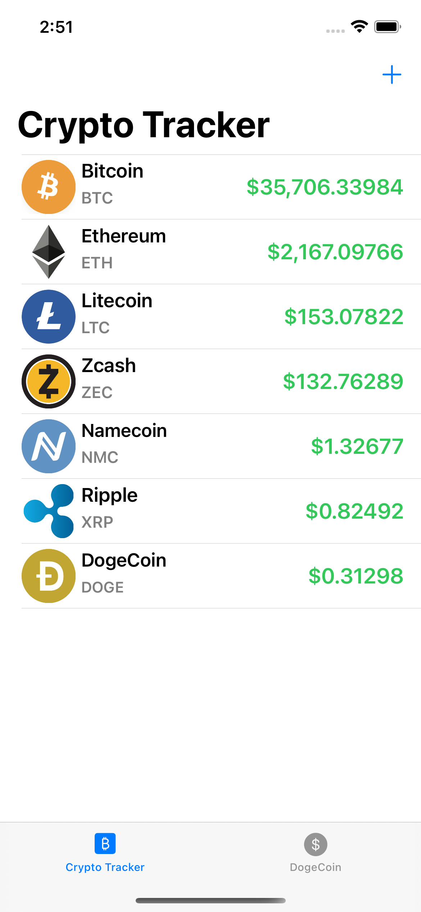
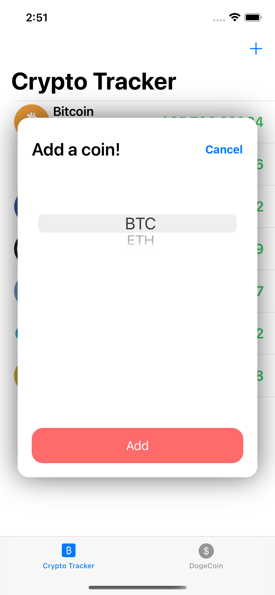
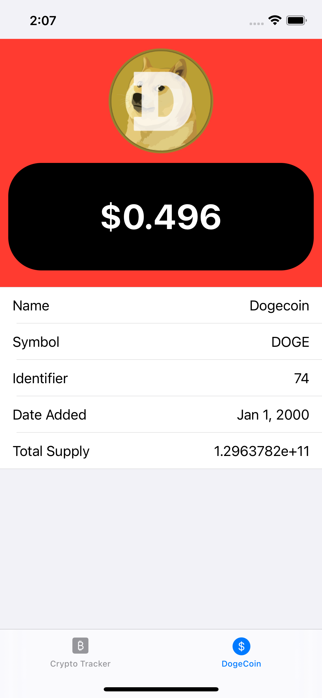
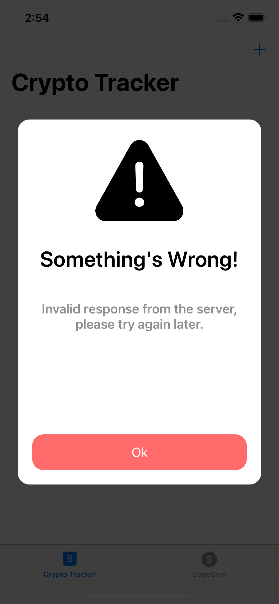

# CyCoin App

An app displays the cryptocurrency price you chose, and a dedicated dogecoin page, fully developed in UIKit.

# Menu
* [Screenshots](#screenshots)
* [Features](#features)
* [To-Do](#to-do)
* [Source](#source)
* [Contributions](#contributions)
* [Contact](#contact)

# Screenshots

 

* Custom Alert Screen

# Features

* Fully programmatically UI
* User default for chosen currency
* Sort by price value
* Customized alert screen
* Pull to refresh
* No third-party library

### To-Do
* Select on the row to show currency details.
* Price colors change depending on the value increased or decreased

### Bugs
* There's a bug in the DogeCoin page that Date added value isn't correct.

# Source
Concept reference: [iOS Academy](https://www.youtube.com/c/iOSAcademy), fully developed in Swift.

### API:

[CoinMarketCap](https://coinmarketcap.com/zh-tw/)

[CoinAPI.io](https://www.coinapi.io)

# Contributions

* All kinds of contributions (enhancements, new features, documentation & code improvements, issues & bugs reporting & todo task) are welcome. Let's make it better.

# Contact
Created by [Terry Kuo](https://twitter.com/ArgonYoYo) - feel free to contact me!
